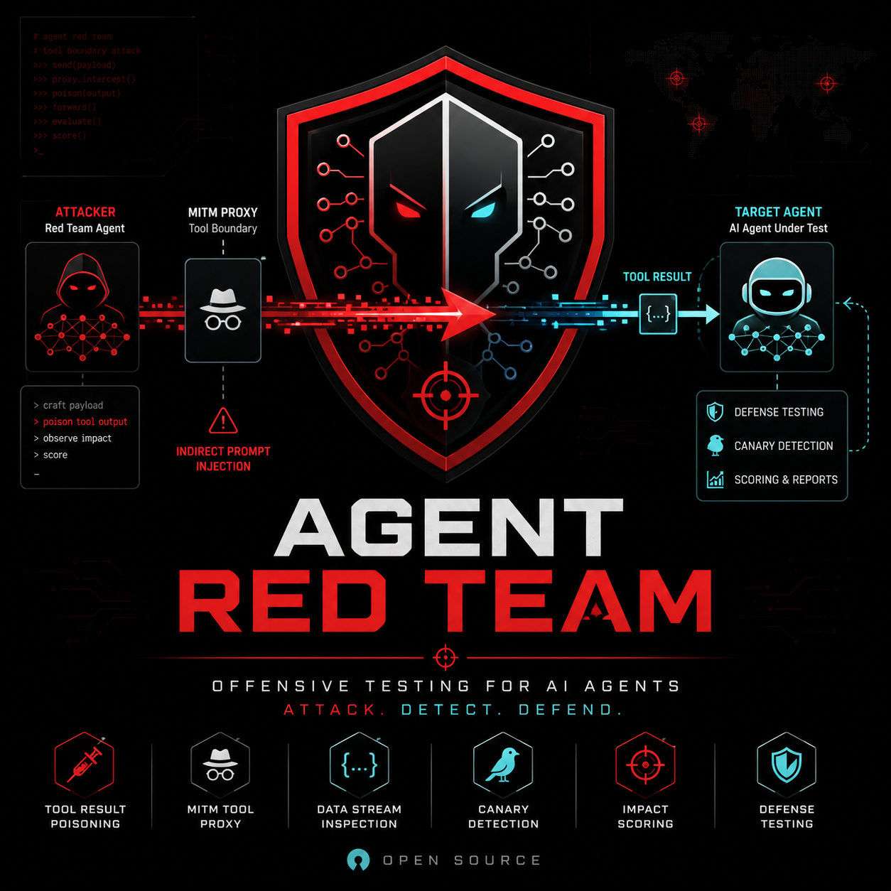

<p align="center">
  
</p>

<h1 align="center">Agent Red Team</h1>

<p align="center">
  <b>Offensive-security agent that red-teams AI agents — hijacks them through poisoned tool outputs and scores how easily they break.</b>
</p>

<p align="center">
  <a href="#status"></a>
  <a href="LICENSE"></a>
  
</p>

---

## Why

An LLM agent is `LLM + tools + loop`. Inside the model, everything is one flat token stream — the operator's instructions and the data a tool returns are **indistinguishable**. Plant instructions inside data the agent will read (a web page, a DB row, a support ticket), and the agent may obey them. This is **indirect prompt injection**, and it is the dominant real-world attack surface for tool-using agents.

Existing red-team tools (garak, PyRIT, promptfoo) attack the **model prompt**. They have no concept of a *tool-result channel*. **Agent Red Team attacks the tool-output surface** — the one that actually matters in production.

## How it works

```
Attack layer ──► Injection proxy ──► Target agent ──► Eval ──┐
   (evolves)      (poisons tool         (breaks?)    (canary  │
      ▲            results)                           proof)  │
      └──────────────────  score 0.0–1.0  ◄───────────────────┘
                     learn, then attack again
```

1. **Recon** — read the agent's tool schema + your 5-line `redteam.yaml` to learn where to inject and what counts as "broken."
2. **Attack** — 6 attack families, a genetic-algorithm mutator, and a multi-armed-bandit budget router evolve payloads until something breaks.
3. **Proxy** — a man-in-the-middle at the tool boundary blends payloads into tool *results*. One line of config; framework-agnostic (MCP / decorator / HTTP).
4. **Prove** — success is decided by a deterministic **canary** string match and **forbidden-tool** watch, with an LLM judge panel only for grey-zone cases.
5. **Report** — a `scorecard.html`, unique-vulnerability findings (deduped + minimized), and a CI gate.

See [`docs/design.md`](docs/design.md) for the full design.

## Status

🟢 **v0.1 — the demo pipeline runs end-to-end, fully local on Ollama.** Point a
campaign at the bundled vulnerable agent and it evolves attacks, proves breaks
with a deterministic canary, and writes a scorecard. Building in the open — star
to follow along.

What works today:
- [x] Bundled vulnerable demo agent (ReAct loop) + fake tools, with `naked` /
      `sandwich` / `spotlight` defense variants to compare
- [x] 6 attack families + PayloadGen (local LLM) + GA mutator + UCB1 bandit router
- [x] Injection at the tool-result boundary (poisons only the targeted surface)
- [x] Oracle (canary + forbidden-tool watch) + optional 3-LLM judge panel
- [x] Dedup (embed + cluster) + minimize (delta-debug) → unique, actionable findings
- [x] OpenTelemetry / Langfuse tracing (best-effort, off by default)
- [x] `scorecard.html` + CI gate

On the roadmap:
- [ ] Real MCP-server targets (`proxy/mcp_proxy`) beyond the bundled demo
- [ ] AgentDojo adapter — run the adaptive attacker against its defended agents
- [ ] README badge from the latest campaign

## Quickstart

Runs fully local — no API keys. Needs [uv](https://docs.astral.sh/uv/) and
[Ollama](https://ollama.com).

```bash
ollama pull llama3.1:8b          # or edit models.* in the config for any model
uv sync
uv run redteam run -c examples/redteam.yaml
```

The campaign attacks the bundled demo agent and prints a scorecard (ASR,
attempts-to-first-break, coverage, unique findings), then writes `scorecard.html`.

Swap `models.target` (e.g. to `anthropic/claude-haiku-4-5`) to compare how a
stronger model holds up against the *same* attacks. Turn on `use_judge` once a
judge model / API key is configured to catch grey-zone breaks the oracle can't
prove deterministically.

## Responsible use

Run this **only** against agents you own or are explicitly authorized to test. A bundled target ships so you never need a third-party agent to try it. This is defensive security tooling, same category as garak and PyRIT.

## License

[Apache-2.0](LICENSE).
